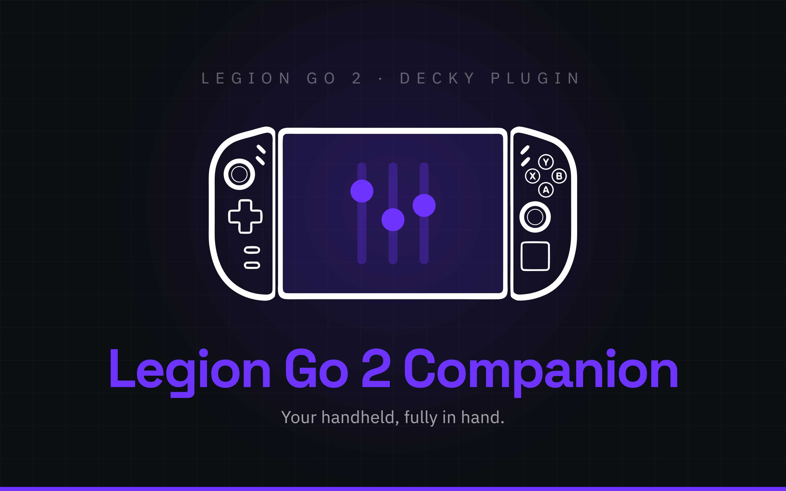
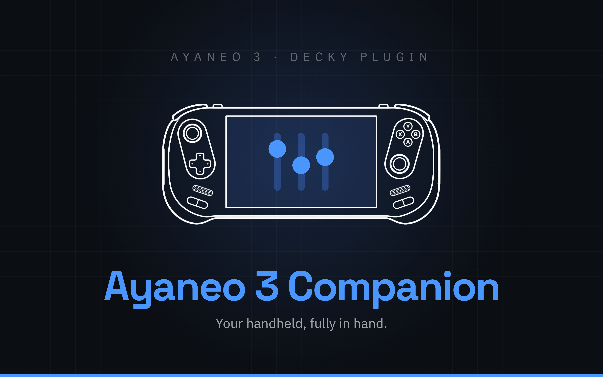
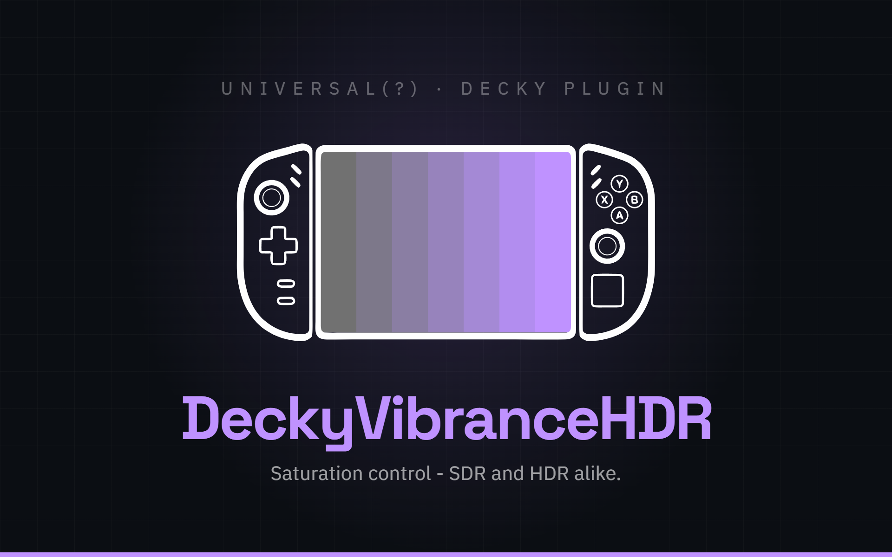
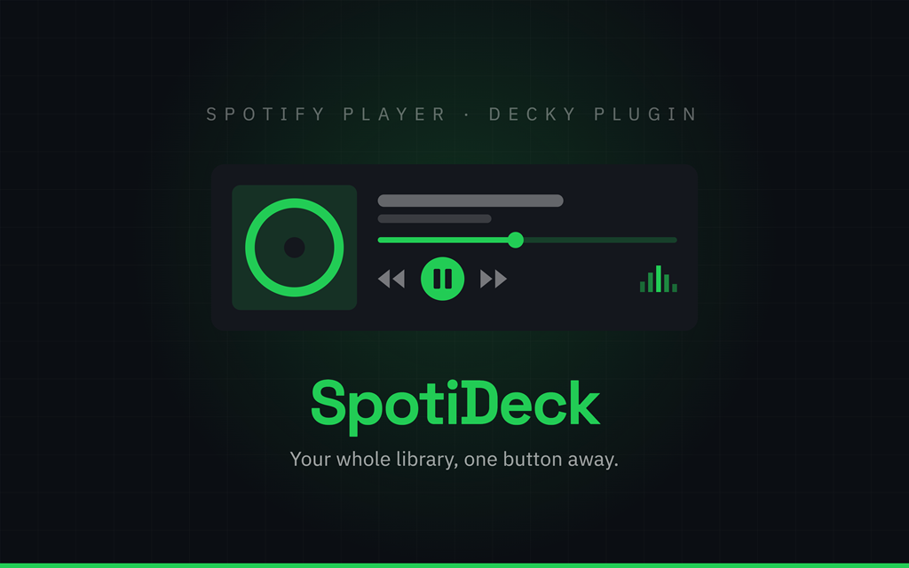
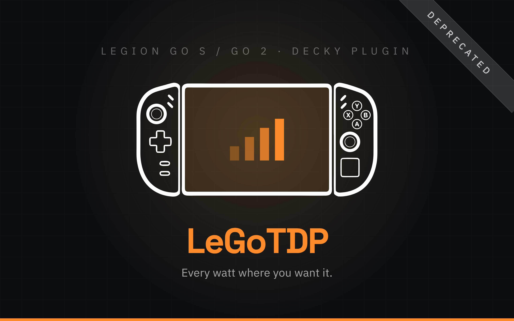
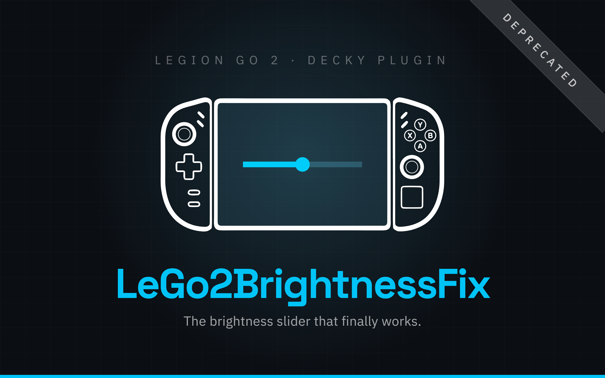

<div align="center">

# Rayek's Decky Store

A custom plugin store for [Decky Loader](https://decky.xyz), holding my plugins for the
Lenovo Legion Go and AYANEO handhelds, plus hardware-independent utilities. Add the address
once and they install and update through Decky's own **Store** tab, like anything else.

</div>

---

## Adding it to Decky

Copy this address:

```
https://decky.rayek.workers.dev
```

On the device, open **Decky → Settings → General → Store channel**, switch it to **Custom**,
and paste the address into the field that appears. The **Store** tab then lists the plugins
below that have a public installation release.

Switching back to **Default** at any time restores the official store. Plugins already
installed from here stay installed.

---

## Plugins

### Legion Go 2 Companion

<div align="center">

<a href="https://github.com/Rayekkk/LegionGo2Companion"></a>

[](https://github.com/Rayekkk/LegionGo2Companion/releases/latest)
[](https://github.com/Rayekkk/LegionGo2Companion/releases)
[](https://github.com/Rayekkk/LegionGo2Companion/blob/main/LICENSE)

</div>

**[Legion Go 2 Companion](https://github.com/Rayekkk/LegionGo2Companion)** brings TDP and CPU profiles, battery protection, controller haptics, gyro, lighting, button remapping, OLED brightness/HDR fixes and Wi-Fi controls into one Steam overlay. It includes the features of LeGoTDP, LeGoVibeControl and LeGo2BrightnessFix.

Uninstall the overlapping standalone plugins before installing Companion, retaining their settings so Companion can import them. See the [migration instructions](https://github.com/Rayekkk/LegionGo2Companion#installation).

---

### AYANEO 3 Companion

<div align="center">

<a href="https://github.com/Rayekkk/Ayaneo3Companion"></a>

[](https://github.com/Rayekkk/Ayaneo3Companion/releases/latest)
[](https://github.com/Rayekkk/Ayaneo3Companion/releases)
[](https://github.com/Rayekkk/Ayaneo3Companion/blob/main/LICENSE)

</div>

**[AYANEO 3 Companion](https://github.com/Rayekkk/Ayaneo3Companion)** brings the handheld's native hardware controls into Decky Loader. TDP profiles, vibration, RGB lighting, charge bypass, Magic Modules, smart-amplifier audio, rear-button bindings and OLED display support are all available from Game Mode.

---

### DeckyVibranceHDR

<div align="center">

<a href="https://github.com/Rayekkk/DeckyVibranceHDR"></a>

[](https://github.com/Rayekkk/DeckyVibranceHDR/releases/latest)
[](https://github.com/Rayekkk/DeckyVibranceHDR/releases)
[](https://github.com/Rayekkk/DeckyVibranceHDR/blob/main/LICENSE)

</div>

**[DeckyVibranceHDR](https://github.com/Rayekkk/DeckyVibranceHDR)** is saturation control under gamescope, in SDR and HDR alike. Which mapping applies is read from the panel's EDID rather than the model name, so it is not tied to one handheld.

---

### SpotiDeck

<div align="center">

<a href="https://github.com/Rayekkk/SpotiDeck"></a>

[](https://github.com/Rayekkk/SpotiDeck/releases/latest)
[](https://github.com/Rayekkk/SpotiDeck/releases)
[](https://github.com/Rayekkk/SpotiDeck/blob/main/LICENSE)

</div>

**[SpotiDeck](https://github.com/Rayekkk/SpotiDeck)** puts Spotify playback, playlists, albums, podcasts, search and your library in the Steam overlay, with separate music and game audio controls and a game/Spotify balance slider. Requires Spotify Premium and your own Spotify Web API Client ID; local playback also requires a Spotify Soloist API key.

---

## Retired plugins

These standalone plugins remain available for existing users, but support has ended and their repositories are archived as read-only. Their features now live in [Legion Go 2 Companion](https://github.com/Rayekkk/LegionGo2Companion).

### LeGoTDP

<div align="center">

<a href="https://github.com/Rayekkk/LeGoTDP"></a>

[](https://github.com/Rayekkk/LeGoTDP/releases/latest)
[](https://github.com/Rayekkk/LeGoTDP/releases)
[](https://github.com/Rayekkk/LeGoTDP/blob/main/LICENSE)

</div>

**[LeGoTDP](https://github.com/Rayekkk/LeGoTDP)** sets AMD CPU TDP limits from the Steam overlay on the Legion Go 2 and Legion Go S, with per-machine presets, per-game profiles and live power draw.

> [!WARNING]
> **Support ended:** LeGoTDP remains functional but will receive no further updates because its features are now part of [Legion Go 2 Companion](https://github.com/Rayekkk/LegionGo2Companion); on Legion Go 2, uninstall this standalone plugin and switch to Companion.

---

### LeGoVibeControl

<div align="center">

<a href="https://github.com/Rayekkk/LeGo-Vibe-Control"></a>

[](https://github.com/Rayekkk/LeGo-Vibe-Control/releases/latest)
[](https://github.com/Rayekkk/LeGo-Vibe-Control/releases)
[](https://github.com/Rayekkk/LeGo-Vibe-Control/blob/main/LICENSE)

</div>

**[LeGoVibeControl](https://github.com/Rayekkk/LeGo-Vibe-Control)** controls vibration intensity, patterns and touchpad haptics on the Legion Go and Legion Go 2, with per-game profiles.

> [!WARNING]
> **Support ended:** LeGoVibeControl remains functional but will receive no further updates because its features are now part of [Legion Go 2 Companion](https://github.com/Rayekkk/LegionGo2Companion); on Legion Go 2, uninstall this standalone plugin and switch to Companion.

---

### LeGo2BrightnessFix

<div align="center">

<a href="https://github.com/Rayekkk/LeGo2BrightnessFix"></a>

[](https://github.com/Rayekkk/LeGo2BrightnessFix/releases/latest)
[](https://github.com/Rayekkk/LeGo2BrightnessFix/releases)
[](https://github.com/Rayekkk/LeGo2BrightnessFix/blob/main/LICENSE)

</div>

**[LeGo2BrightnessFix](https://github.com/Rayekkk/LeGo2BrightnessFix)** restores Steam brightness control on the Legion Go 2 OLED in HDR and gives games the panel's real HDR metadata.

> [!WARNING]
> **Support ended:** LeGo2BrightnessFix remains functional but will receive no further updates because its features are now part of [Legion Go 2 Companion](https://github.com/Rayekkk/LegionGo2Companion); on Legion Go 2, uninstall this standalone plugin and switch to Companion.

---

## How this store works

There is no server. `plugins.json` is the entire store: Decky fetches it, parses it as a list
of plugins, and downloads each zip straight from its own GitHub release.

`build_store.py` regenerates the file. It reads `plugin.json` from each plugin repo on GitHub for the
name, author, description and tags, lists published stable releases, and hashes each new
published zip so Decky can verify what it downloaded. Run it after a release and commit the
result. Store artwork is kept in `assets/`, plugin IDs stay stable, and retired plugins retain their support notices. Draft and prerelease versions are excluded. **The address never changes.**

```bash
python build_store.py
git commit -am "Refresh the store" && git push
```

The file is served by GitHub Pages from `main`, and `worker.js` fronts it at the address
above. A push takes a minute or so to appear.

The worker exists for one reason. Decky adds an `X-Decky-Version` header, which makes the
request non-simple, so the browser sends a `OPTIONS` preflight first and only issues the real
`GET` if the answer names that header. **No static host answers it:** GitHub Pages replies
405, `raw.githubusercontent` 403, and jsDelivr replies 200 but without
`Access-Control-Allow-Headers`, which the browser rejects just the same. A blocked request
leaves the store spinning forever rather than showing an error, because `Store.tsx` has no
`catch` around the fetch.

The worker never needs redeploying. It reads whatever `plugins.json` currently says.

Three details the file has to get right, all handled by the generator:

- **`artifact`** must be present on every version. Without it Decky falls back to the official
  CDN, which does not have these plugins.
- **`hash`** is the SHA-256 of the zip and is verified after download; a mismatch refuses the
  install.
- **`name`** must match `plugin.json` exactly, because that is how Decky matches an installed
  plugin against a store entry when it checks for updates.

---

<div align="center">

*Plugins are BSD 3-Clause. See each repository for its own licence and notices.*

</div>
